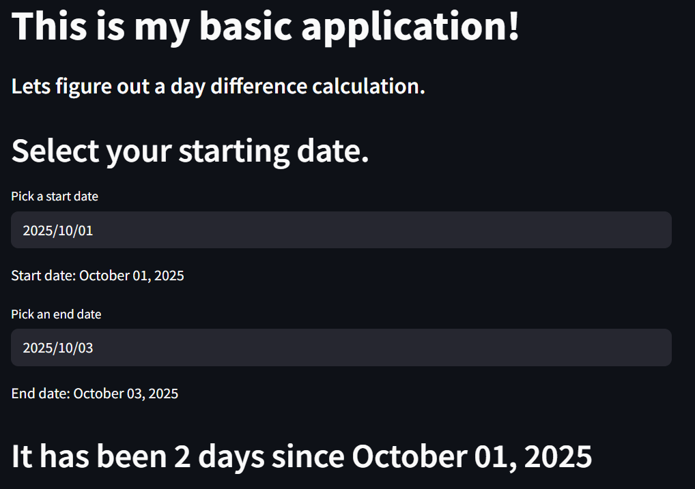

# **Difference calculator application**

This application has the user select a start date, an end date, and will calculate how many days have gone by. This can be useful when trying to figure out how many days until a specific even, or how many days have gone by since "this" happened.

Check out the screenshot below for what the app looks like.

